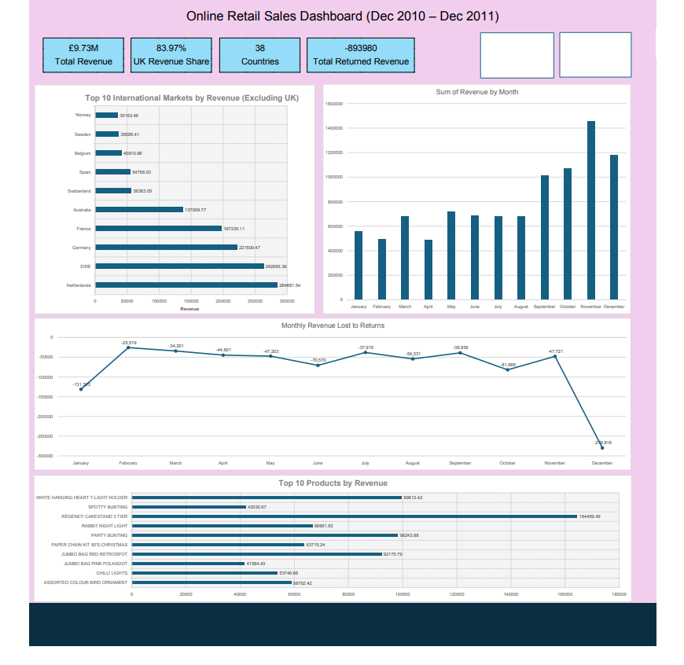

# 📊 Online Retail Sales Dashboard (Dec 2010 – Dec 2011)

An end-to-end **Microsoft Excel Data Analytics Project** that transforms raw transactional retail data into an interactive business intelligence dashboard.

This project demonstrates the complete analytics workflow, from data cleaning and feature engineering to exploratory data analysis, KPI development, dashboard design, and business storytelling.

---

# 📌 Project Overview

The objective of this project was to analyze transactional sales data from an online retail company operating between **December 2010 and December 2011**.

Using Microsoft Excel, the raw transactional dataset was transformed into an interactive dashboard capable of providing actionable business insights into:

- Sales performance
- Revenue trends
- International market performance
- Product performance
- Return behaviour

The dashboard was built entirely using **Excel PivotTables, PivotCharts, KPI Cards, and Slicers**, demonstrating practical business intelligence techniques without external tools.

Due to GitHub's file size limitations, the complete Excel project workbook is hosted on Google Drive.

The workbook includes:

- Raw Dataset
- Data Cleaning & Preparation
- Feature Engineering
- Exploratory Data Analysis (EDA)
- PivotTables & PivotCharts
- Interactive Dashboard

👉 **[Download the Complete Excel Project](https://drive.google.com/drive/folders/1K0bwxIf5v1IEtGSmSNBDWyjHgCDAc2is?usp=drive_link)**

---

# 🎯 Business Objectives

The dashboard was designed to answer the following business questions:

- How much revenue did the business generate?
- How did revenue change throughout the year?
- Which international markets generated the highest revenue?
- Which products generated the most revenue?
- How much revenue was lost through product returns?
- During which months were returns highest?

---

# 📂 Dataset

**Dataset:** Online Retail II

The dataset contains transactional sales records including:

- Invoice Number
- Stock Code
- Product Description
- Quantity
- Invoice Date
- Unit Price
- Customer ID
- Country

Each row represents an individual product purchased within a customer invoice.

---

# 🧹 Data Cleaning & Preparation

## Overview

The raw dataset was reviewed and cleaned to improve data quality, remove inconsistencies, and prepare the data for business analysis.

The cleaning process focused on improving data consistency while preserving legitimate business transactions.

---

## Cleaning Process

### 1. Duplicate Removal

- Reviewed the dataset for duplicate records.
- Removed exact duplicate rows across all available columns using Excel's **Remove Duplicates** feature.
- Prevented identical transactions from being counted multiple times during analysis.

---

### 2. Invoice & Stock Code Standardization

- Removed leading and trailing spaces from the **Invoice** and **StockCode** columns using Excel functions.
- Validated cleaned values before replacing the originals.
- Improved consistency of transaction and product identifiers.

---

### 3. Date & Time Processing

The original **InvoiceDate** column was transformed into separate analytical columns:

- Invoice_Date
- Invoice_Time

This preserved the original timestamp while improving flexibility for reporting and time-based analysis.

---

### 4. Data Type Validation

Verified that:

- Unit Price was stored as a numeric value.
- Date and time fields were correctly recognised by Excel.
- Invoice and StockCode remained stored as text.

---

### 5. Missing & Invalid Record Assessment

A review of missing values identified records containing:

- Blank product descriptions
- Blank customer identifiers
- Zero-priced transactions

A total of **1,454 records** contained all three issues simultaneously.

These records were removed because they could not contribute meaningfully to product, customer, or revenue analysis.

---

### 6. Customer ID Assessment

Approximately **133,583 records** contained missing customer identifiers.

These transactions were retained because they still represented valid sales activity and remained useful for:

- Revenue analysis
- Product analysis
- Country analysis
- Time-series analysis

Customer IDs were only excluded during customer-specific analysis.

---

### 7. Return Transactions

Invoices beginning with **"C"** were investigated.

A total of **9,251 return transactions** were identified.

Rather than deleting these records, they were retained because they represent legitimate returns and cancellations, ensuring revenue reflects **net sales** rather than gross sales.

---

# ⚙️ Feature Engineering

To simplify analysis and improve dashboard functionality, several additional analytical columns were created.

---

## Revenue

A new **Revenue** column was created using:

```
Revenue = Quantity × Unit Price
```

This became the primary business metric used throughout the dashboard.

---

## Month & Year

Additional date attributes were extracted from the invoice date:

- Month
- Year

These fields enabled:

- Monthly revenue analysis
- Monthly return analysis
- Interactive dashboard filtering

---

## Invoice Type

Invoices were classified into:

- Sales Invoice
- Return Invoice

Invoices beginning with **"C"** were automatically labelled as **Return Invoice**, allowing returns to be analysed separately from standard sales.

---

## Product Type

A helper column was created to distinguish genuine products from service-related transactions.

Descriptions ending with:

- FEE
- POSTAGE
- CHARGE
- CHARGES
- DISCOUNT

were automatically classified as **Service**, while all remaining records were classified as **Product**.

This allowed service-related transactions such as postage charges, administrative fees, and discounts to be excluded from product performance analysis, ensuring that product rankings reflected actual merchandise.

---

## Feature Engineering Outcome

Creating these additional analytical columns simplified PivotTable creation, improved dashboard interactivity, and enabled more meaningful business analysis without modifying the original transactional records.

---

# 📊 Exploratory Data Analysis

Several PivotTables were created to explore the dataset before developing the dashboard.

The analysis focused on:

- Monthly revenue
- Revenue by country
- UK revenue contribution
- Product performance
- Return behaviour

This exploratory analysis guided the design of the final dashboard and helped identify the most relevant business insights.

---

# 📈 Dashboard

The final dashboard provides an interactive overview of retail sales performance.

---

## KPI Cards

The dashboard includes four key performance indicators:

- 💰 Total Revenue
- 🇬🇧 UK Revenue Share
- 🌍 Countries Served
- ↩️ Total Returned Revenue

---

## Visualizations

- 📈 Monthly Revenue Trend
- 🌍 Top 10 International Markets (Excluding UK)
- 🛍️ Top 10 Products by Revenue
- ↩️ Monthly Returned Revenue

---

## Interactive Filters

The dashboard includes interactive slicers allowing users to explore the data dynamically by:

- 🌍 Country
- 📅 Month

---

# 💡 Business Insights

## Revenue Performance

The business generated approximately **£9.73 million** in revenue during the analysis period.

---

## UK Market Dominance

Country-level analysis revealed that the **United Kingdom accounted for approximately 83.97% of total revenue**.

Because the UK overwhelmingly dominated total sales, it was intentionally excluded from the **Top 10 International Markets** visualization.

Without excluding the UK, meaningful comparisons between the remaining international markets would have been difficult because the UK's revenue significantly exceeded every other country.

---

## Top International Markets (Excluding UK)

After excluding the United Kingdom, the strongest international markets were:

1. 🇳🇱 Netherlands
2. 🇮🇪 EIRE
3. 🇩🇪 Germany
4. 🇫🇷 France
5. 🇦🇺 Australia
6. 🇨🇭 Switzerland
7. 🇪🇸 Spain
8. 🇧🇪 Belgium
9. 🇸🇪 Sweden
10. 🇳🇴 Norway

This design decision highlights the retailer's strongest international markets while preventing one country from dominating the visualization.

---

## Product Performance

Service-related transactions such as postage fees, discounts, and administrative charges were excluded from product performance analysis.

This ensured that the Top Products visualization represented genuine merchandise rather than operational service charges.

The highest revenue-generating product was:

**REGENCY CAKESTAND 3 TIER**

---

## Returns Analysis

Approximately **£894,000** of revenue was associated with return transactions.

Returned revenue remained relatively stable throughout most of the year before increasing significantly during **December**, with **January** recording the second-highest level of returns.

This suggests a strong post-holiday return pattern.

---

# 🛠️ Tools & Technologies

- Microsoft Excel
- PivotTables
- PivotCharts
- KPI Cards
- Slicers
- Conditional Formatting

### Excel Functions Used

- IF()
- OR()
- LEFT()
- RIGHT()
- TRIM()
- INT()
- MOD()
- TEXT()
- GETPIVOTDATA()

---

# 📁 Repository Structure

```
Online-Retail-Sales-Dashboard
│
├── Data
│   └── Online Retail II.xlsx
│
├── Dashboard
│   └── Online Retail Dashboard.xlsx
│
├── Images
│   └── Dashboard Preview.png
│
└── README.md
```

---

# 📷 Dashboard Preview

> **Dashboard Preview**



---

# 🚀 Skills Demonstrated

- Data Cleaning
- Data Validation
- Feature Engineering
- Data Transformation
- Exploratory Data Analysis (EDA)
- Business Intelligence
- KPI Development
- Dashboard Design
- PivotTable Analysis
- PivotChart Development
- Interactive Dashboard Design
- Business Storytelling
- Microsoft Excel

---

# 📌 Key Takeaways

This project demonstrates the complete end-to-end workflow of transforming raw transactional retail data into an interactive business dashboard using Microsoft Excel.

Beyond creating visualizations, the project emphasizes analytical decision-making through:

- Cleaning and validating raw business data
- Engineering additional analytical features
- Preserving legitimate return transactions for accurate net revenue analysis
- Separating products from service-related transactions
- Designing business-focused visualizations
- Presenting actionable insights through an interactive dashboard

The final result is a professional Excel dashboard that enables users to explore retail performance, identify high-performing international markets, evaluate product performance, and understand customer return behaviour while demonstrating practical data analytics and business intelligence skills.

---

## 👨‍💻 Author

**Abdullah**

LinkedIn : https://linkedin.com/in/muhammad-abdullah-62647829b

Aspiring Data Analyst passionate about transforming raw data into meaningful business insights through data cleaning, visualization, and dashboard development.

If you found this project interesting, feel free to connect with me or explore my other projects on GitHub.
